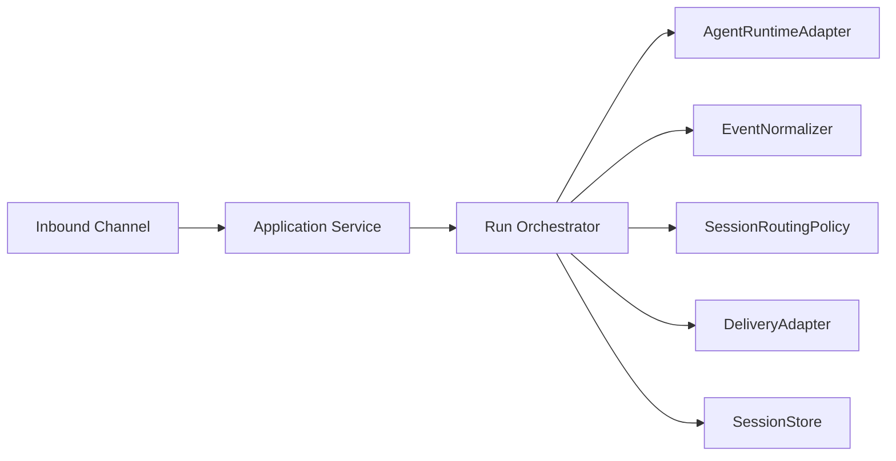
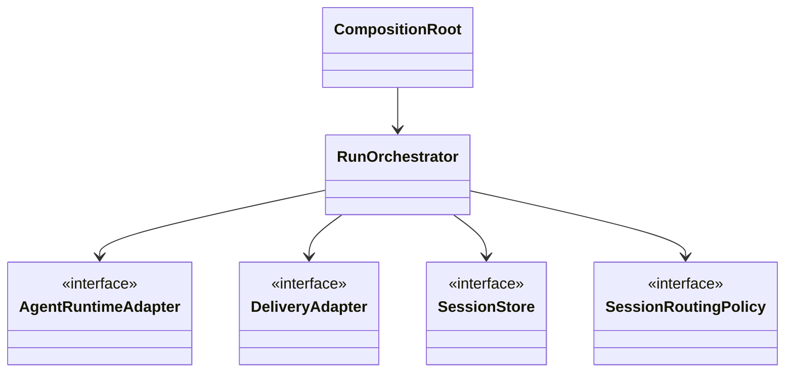

# Adapter Strategy + DI Spec

이 문서는 provider-agnostic upstream 실행과 transport-agnostic downstream 전달을 위한 정규 아키텍처 계약을 정의한다.

hermux의 핵심 확장성 전략은 upstream provider(현재 opencode, 목표: Claude Code CLI, Codex CLI, Cursor CLI 등)와 downstream channel(현재 Telegram, 목표: Slack, webhook, stdout 등)을 플러그 가능한 어댑터로 분리하는 것이다.

## Scope

In scope:

- pluggable upstream runtime providers (OpenCode, Claude Code CLI, Codex CLI, Cursor CLI)
- pluggable downstream delivery channels (Telegram and non-Telegram channels)
- canonical event model shared across providers/channels
- composition root and dependency-injection wiring

Out of scope:

- provider-specific flag details and parser implementation
- channel-specific rendering templates
- migration scripts for historical state files

## 1) Architectural Contract

The runtime MUST be split into the following replaceable boundaries:

1. `AgentRuntimeAdapter` (upstream strategy)
2. `EventNormalizer` (provider event -> canonical event)
3. `SessionRoutingPolicy` (session-scoped delivery decision)
4. `DeliveryAdapter` (downstream strategy)
5. `SessionStore` (chat/session continuity persistence)

The orchestration layer MUST depend only on these interfaces and MUST NOT depend directly on provider or channel SDK/CLI APIs.

Incremental refactor rule:

- `src/gateway.js` MAY remain the composition root during migration, but its remaining provider/channel-specific logic MUST move behind adapter or app-service seams slice by slice.
- Compatibility shims MAY exist temporarily (for example `src/lib/runner.js`), but they MUST stay thin and MUST NOT become new homes for provider-specific behavior.

## 2) Canonical Event Contract

All upstream events MUST be converted to a canonical envelope before routing.

Required fields:

- `id: string` (event identity for idempotency)
- `source: string` (provider id)
- `ts: string` (ISO timestamp)
- `runId: string`
- `type: string` (canonical type)
- `payload: object | string`

Optional fields:

- `sessionId: string`
- `role: "user" | "assistant" | "system" | "tool"`
- `raw: object | string` (original frame for diagnostics)

Canonical type set MUST include at least:

- `run.started`, `run.progress`, `run.completed`, `run.failed`
- `message.delta`, `message.final`
- `tool.started`, `tool.output`, `tool.completed`
- `session.updated`
- `raw`

## 3) Interface Contracts

### 3.1 AgentRuntimeAdapter

`AgentRuntimeAdapter` MUST provide:

- `capabilities()` for feature flags (resume/revert/unrevert/cancel scope support)
- `startRun(input, onEvent)` for streamed execution
- `cancelRun(runId, scope?)`

Optional operations MAY be exposed when supported:

- `revert(input)`
- `unrevert(input)`

Unsupported optional operations MUST fail with explicit capability errors.

### 3.2 DeliveryAdapter

`DeliveryAdapter` MUST provide:

- `sendEvent(target, canonicalEvent)`
- `sendControl(target, text)`

Delivery adapters MUST NOT mutate canonical event meaning. Presentation formatting MAY be applied per channel.

Operational rule:

- channel-specific retries, chat actions, draft-preview behavior, transport fallbacks, and formatting/chunking MUST live inside the delivery-adapter boundary or helper modules owned by that boundary.

### 3.2.1 Run View Snapshot Boundary (Normative)

For streaming answer delivery, upstream logic MUST emit a provider-agnostic `RunViewSnapshot` before downstream delivery.

Required shape:

- `runId: string`
- `sessionId: string`
- `messages: string[]` (ordered logical text blocks ready for downstream formatting and diff/send)
- `isFinal: boolean`

Optional metadata:

- `updatedAtMs: number`
- `meta: object`

Rules:

- Downstream adapters MUST consume only `RunViewSnapshot` (or commands derived only from snapshot diff).
- Downstream adapters MUST NOT parse provider-specific raw event schemas (for example OpenCode `message.part.delta`, `session.status`, etc.).
- Provider/event-specific parsing MUST remain in upstream adapter/normalizer layer.
- Last-snapshot application MUST be safe because snapshot is already materialized view state.
- Upstream snapshot builders MUST NOT split or truncate `messages` for Telegram or any other downstream transport limit.
- Downstream adapters MAY apply presentation formatting per channel, but any transport-size chunking MUST occur after that formatting step.
- Visible content MUST be preserved by chunk splitting rather than silent truncation when a downstream transport limit is exceeded.

### 3.3 SessionRoutingPolicy

Routing policy MUST provide deterministic functions:

- `shouldDeliver(event, currentBinding)`
- `nextBinding(event, currentBinding)`

Default policy MUST be session-centric:

- if `currentBinding.sessionId` and `event.sessionId` both exist and mismatch, drop delivery
- if no current binding and event has session id, adopt that session id

### 3.4 SessionStore

Session store MUST provide:

- `get(chatKey)`
- `set(chatKey, binding)`
- `clear(chatKey)`

Store semantics MUST remain idempotent for clear operations.

## 4) Strategy Registry Contract

Composition root MUST resolve strategies by ids from config:

- upstream ids: `opencode-sdk`, `opencode-cli`, `claude-cli`, `codex-cli`, `cursor-cli`
- downstream ids: `telegram`, `slack`, `webhook`, `stdout`

Unknown strategy ids MUST fail fast at startup with actionable errors.

## 5) Lifecycle Contract

Execution lifecycle MUST follow:

1. resolve chat binding from `SessionStore`
2. start upstream run with adapter
3. normalize incoming events
4. apply session routing policy
5. materialize `RunViewSnapshot` in upstream boundary
6. deliver snapshot via downstream adapter
7. update session binding when required by policy

Run completion MUST NOT imply adapter-specific event reinterpretation.

## 6) Capability Matrix Contract

The orchestrator MUST branch by `capabilities()` and MUST NOT hardcode provider assumptions.

Required capability keys:

- `supportsSessionResume: boolean`
- `supportsRevert: boolean`
- `supportsUnrevert: boolean`
- `cancelScopes: string[]`

## 7) Error Contract

Provider/channel-specific errors MUST be wrapped into common error categories:

- `upstream_unavailable`
- `upstream_protocol_error`
- `routing_rejected`
- `delivery_failed`
- `capability_unsupported`

Errors surfaced to users SHOULD contain a stable category and concise recovery hint.

## 8) Non-Regression Rules

- Existing per-repo single-run lock and queue semantics MUST be preserved.
- Session-map continuity behavior MUST be preserved.
- Interrupt/restart command semantics MUST remain idempotent.
- Canonical event emission MUST remain auditable.

## 9) Migration Guardrails

- Each refactor slice MUST preserve current user-visible behavior and session-first late-event semantics.
- Docs/contracts must be updated before code in each non-trivial slice.
- Contract tests must be added or updated before implementation in each slice.

## 10) Diagrams

### 10.1 Boundary Diagram

### 10.2 DI Composition Diagram

